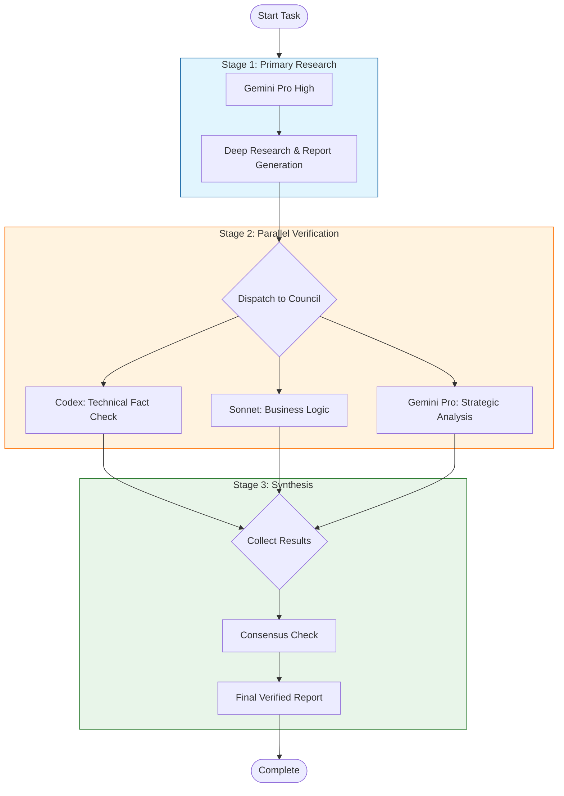

# Model Council 系統架構

## 設計理念
Multi-model verification system inspired by Perplexity's model council, optimized for Jacob's bioinformatics + business use cases.

## 核心優勢
1. **省 Token**: Gemini 做重活（1,500 免費搜尋/天）
2. **高信心**: 3 模型交叉驗證
3. **快速**: 平行執行（3-5 分鐘）
4. **專業分工**: 每個模型發揮所長

## 3-Stage Pipeline

### Stage 1: Primary Research (Gemini Pro High)
- **時間**: 5-10 分鐘
- **成本**: 免費（Gemini grounding 1,500/天）
- **輸出**: 完整研究報告（~5-10k tokens）

### Stage 2: Parallel Verification (3 Models)
- **時間**: 3-5 分鐘（平行）
- **成本**: ~30k tokens total (10k/model)
- **模型分工**:
  - **Codex**: 技術事實查核（數字、引用、術語）
  - **Sonnet**: 商務邏輯驗證（可行性、風險、遺漏）
  - **Gemini Pro**: 戰略深度分析（長期影響、替代方案）

### Stage 3: Synthesis (Main Session)
- **時間**: 2-3 分鐘
- **方法**: 模板驅動整合
- **輸出**: 最終驗證報告

## 共識機制
- **2/3 同意** → 共識點（高信心）
- **1/3 反對** → 分歧點（標註理由）
- **全體反對** → Critical issue（必須修正）

## 適用場景
✅ 商務報告（市場分析、競爭者研究）
✅ 技術分析（技術選型、架構設計）
✅ 學術文獻（文獻綜述、方法驗證）
❌ 簡單問答（overkill）
❌ 緊急任務（太慢）

## 流程圖

